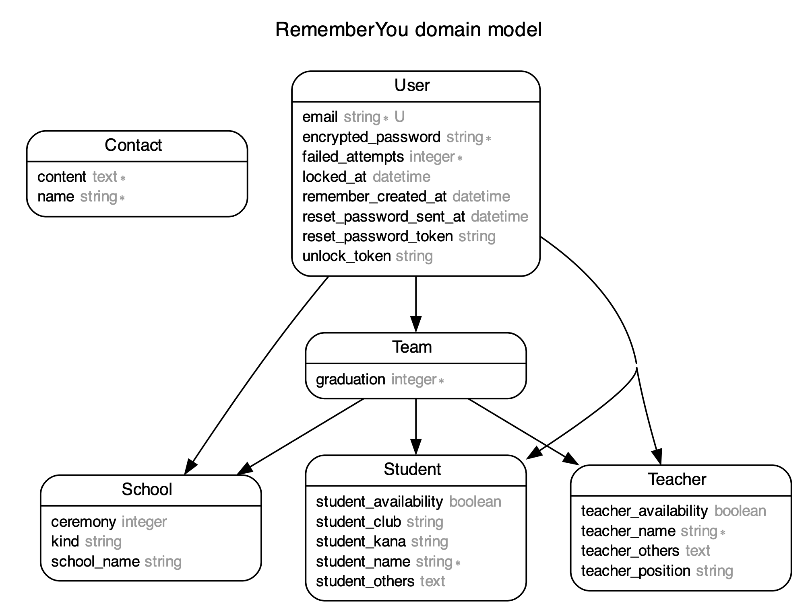
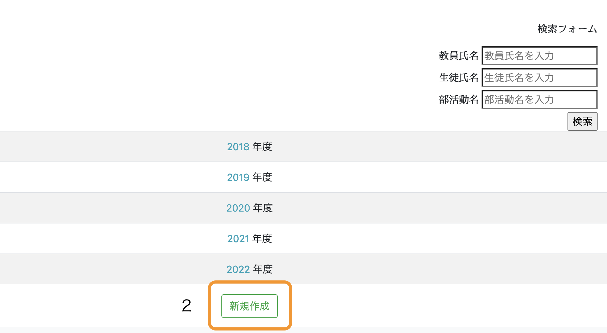
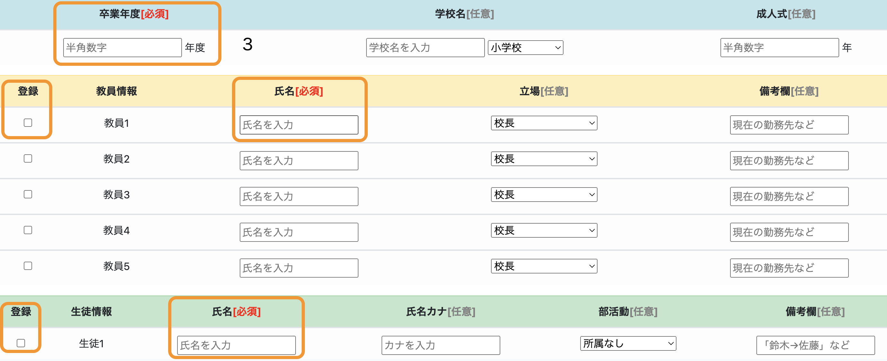
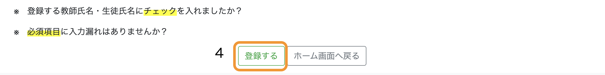
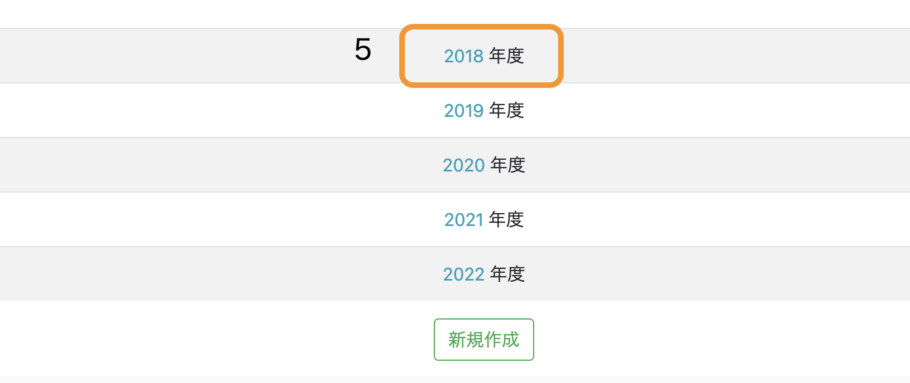

# Remember You  

* 今まで関わった生徒や教員仲間の情報を管理するサイトです。

* 覚えておきたい生徒や教員仲間の情報を入力し、一覧で確認することができます。

https://rememberyou.herokuapp.com/remember_you/records

# 使用技術

* Ruby 3.0.5

* Ruby on Rails 6.1.7

* SQLite3 1.6.0

* Puma 5.6.5

* Heroku

* CircleCi CI/CD

* RSpec

* Rubocop Airbnb 4.0.0

# ER図

  

# 機能一覧

### １. ユーザー登録、ログイン機能(devise)
* 不正登録防止機能(reCAPTCHA)  
* ゲストログイン機能
* 管理者ログイン機能(cancancan,rails_admin)

### ２. お問い合わせ機能

### ３. 新規作成・編集・削除機能   
(登録できる項目)
* 卒業年度[必須]
* 学校名
* 成人式
* 教員氏名[必須]
* 立場
* 備考欄
* 生徒氏名[必須]
* 生徒カナ
* 部活動
* 備考欄
### ４. 検索機能(ransack)
* 教員氏名
* 生徒氏名
* 部活動

# テスト

### RSpec
* 単体テスト(model)
* 機能テスト(request)
* 統合テスト(system)

# こだわり

### １.　シンプルで見やすいレイアウト   
  幅広い世代の先生方に使用していただくことを想定して作りました。

### ２.　安心のセキュリティー  
  個人情報を入力しますが、不正アカウント対策(reCAPTCHA)やセッションタイムアウトなど、大切な情報の管理に力を入れました。

### ３.　膨大な情報の中から、思い出したい生徒や先生をすぐに検索   
  「誰だったっけ・・・」というときにも、スマホ１つで検索して確認することができます。(レスポンシブ対応済み)

# Remember You を作るきっかけ

  

# 使い方
### １ 「アカウント登録」もしくは「ログイン」(企業様はゲストログインをお勧めします)

  

### ２ メールアドレス、パスワードを入力後、新規作成ボタンを押す

  

### ３ 登録したい内容を入力

 
  
_※ 必須項目は必ず入力してください。_

_※ 教員、生徒の情報を追加する場合は、「登録」に必ずチェックを入れてください。_
  
_※ 教員は最大５人、生徒は４０人まで登録できます。_

### ４ 注意事項を確認して、「登録する」ボタンを押す

  

### ５ 登録した卒業年度が表示されていれば、登録完了

  

### ６ あとは必要に応じて、編集や検索をお楽しみください

# 今後追加していきたい機能

* 思い出の画像保存機能

* 登録したい情報のExcel入力・出力機能

#### お問い合わせいただいた欲しい機能も追加していきます。

# 最後に
### 最後まで読んでいただきありがとうございます。皆様からいただいた声をもとに、バージョンアップを重ねていきます。
